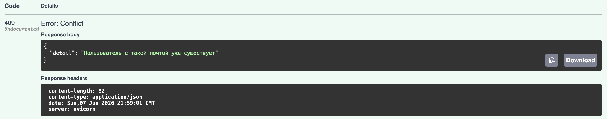
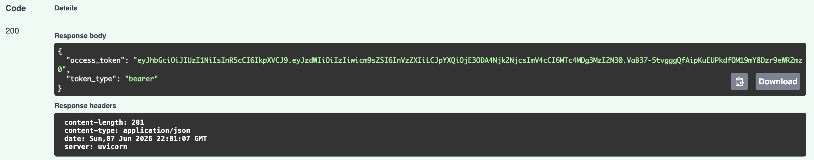
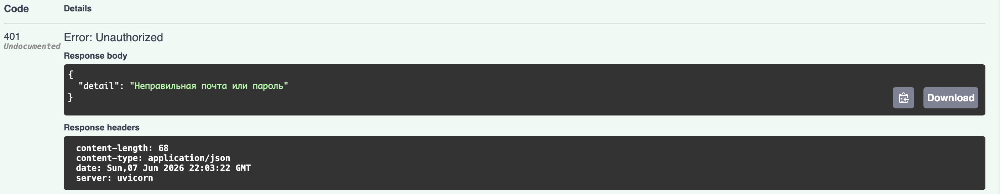
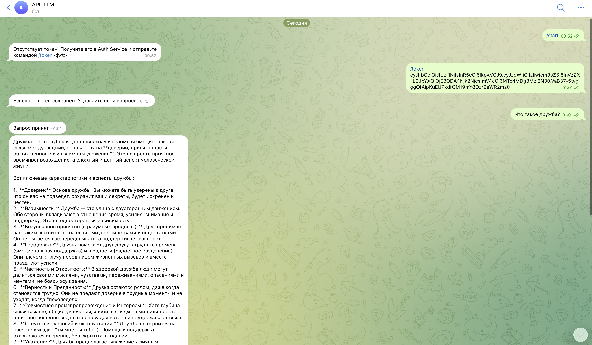
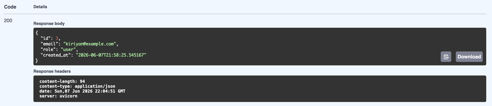
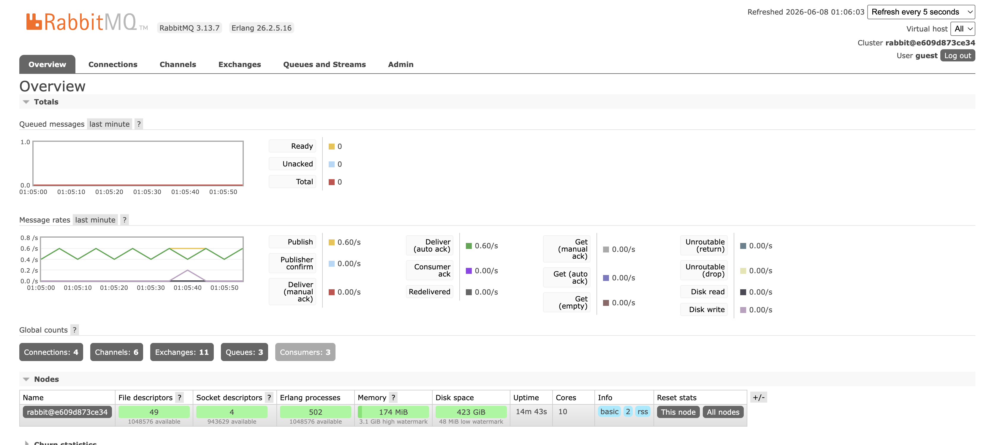
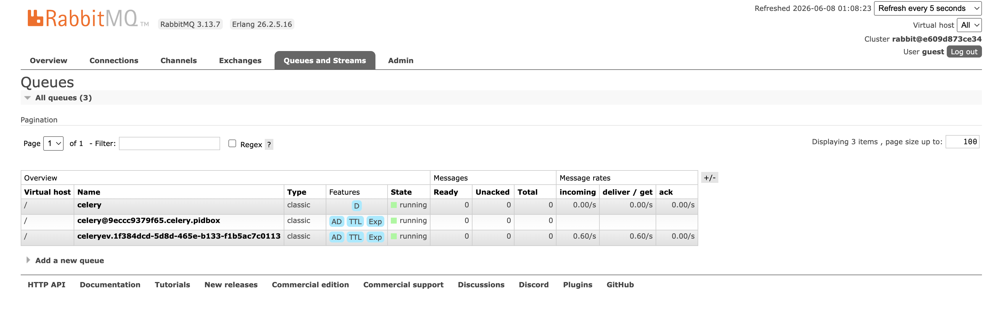
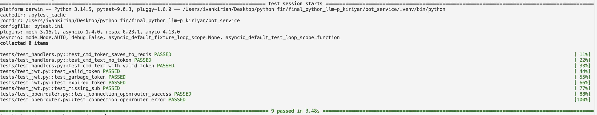
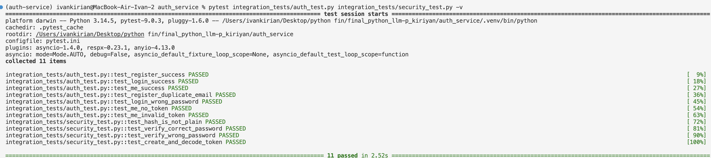

# Двухсервисная система LLM-консультаций | Выполнил: студент группы М25-555 Иван Кириян

# О проекте:
В рамках проекта разработана распределённая система, состоящая из двух логически и технически независимых сервисов, каждый из которых выполняет строго определённую роль. Архитектура построена по принципу разделения ответственности: один сервис отвечает исключительно за аутентификацию и выпуск токенов, второй — за предоставление функциональности LLM-консультаций через Telegram-бота. Такое разделение позволяет изолировать чувствительную логику работы с пользователями и учетными данными от прикладного сервиса, работающего с внешними пользователями и внешними API.

Ключевая идея проекта заключается в том, что Telegram-бот не знает ничего о пользователях, паролях и механизмах регистрации. Он доверяет только корректно подписанному и не истёкшему JWT-токену, выданному специализированным сервисом авторизации. Это приближает архитектуру проекта к реальным микросервисным системам и демонстрирует принципы построения безопасных распределённых приложений.

Перед отправкой перепроверил поднятие проекта. Результат воспроизводимый.

# Архитектура проекта
```
final_python_llm-p_kiriyan/
├── docker-compose.yml                  -- настройки докера
├── auth_service/                       -- сервис регистрации
│   ├── Dockerfile
│   ├── .env
│   ├── pyproject.toml
│   └── app/
│       ├── main.py
│       ├── core/
│       │   ├── config.py               -- настройки приложения
│       │   ├── security.py             -- функции безопасности
│       │   └── exceptions.py           -- http-исключения
│       ├── db/
│       │   ├── base.py                 -- базовый класс sqlalcemy
│       │   ├── session.py              -- фабрика сессий
│       │   └── models.py               -- модель пользователя
│       ├── schemas/
│       │   ├── auth.py                 -- схемы регистрации токенов
│       │   └── user.py                 -- публичное представление пользователя
│       ├── repositories/
│       │   └── users.py                -- доступ к пользователям
│       ├── usecases/
│       │   └── auth.py                 -- бизнес-логика аутентификации
│       └── api/
│           ├── deps.py                 -- зависимости FastAPI
│           ├── routes_auth.py          -- эндпоинты аутентификации
│           └── router.py               -- сборка роутеров
└── bot_service/                        -- бот сервис
    ├── Dockerfile
    ├── .env
    ├── pytest.ini
    ├── pyproject.toml
    └── app/
        ├── main.py
        ├── core/
        │   ├── config.py               -- конфиги
        │   └── jwt.py                  -- функция проверки токена
        ├── infra/
        │   ├── redis.py                -- единая точка redis-клиента
        │   └── celery_app.py           -- регистрация тасок
        ├── services/
        │   └── openrouter_client.py    -- образение к опенроутеру
        ├── bot/
        │   ├── dispatcher.py           -- роутеры
        │   └── handlers.py             -- логика общения
        └── tasks/
            └── llm_tasks.py            -- celery-задача
```

# Как перенести проект к себе?

## Шаг 1. Копирование с гитхаб

```
git clone https://github.com/IvanKiriyan/final_python_llm-p_kiriyan.git
cd final_python_llm-p_kiriyan
```

## Шаг 2. Вставление ключей

Как только скопировали проект к себе, откройте в папке bot_service файл .env-example и переименуйте в .env -- затем вставьте ключи в файл

```.env

TELEGRAM_BOT_TOKEN= вставьте api-ключ из сервиса BotFather в Telegram
...
OPENROUTER_API_KEY= вставьте api-ключа с сервиса OpenRouter
...
OPENROUTER_MODEL= вставьте название актуальной модели
```

## Шаг 3. Запуск докера

Из корня проекта запустите команду, она поднимает сервисы, описанные в compose-файле.

```
docker compose up
```

## Шаг 4. Получение собственного токена для работы с ботом


Получите JWT access token для работы с ботом.

## Шаг 5. Зайдите в бот

Полученный токен отправьте в бота

```
/token exampleldakfadfdafsfdsfsdmlfsmls
```

После подтверждения токена можно работать с ним.

## Наслаждайтесь!

# Демонстрация работы контрольных точек проекта

## 1) Пример регистрации




## 2) Авторизация





### Отсюда скопировал свой ключ - и вставил в бота в телеграмме.

## 3) Telegram-bot



## 4) /me в Swagger



## 5) А тем временем - что в момент моего общения с ллм происходило в RabbitMQ





## 6) Проведенные внутренние мок-тесты



